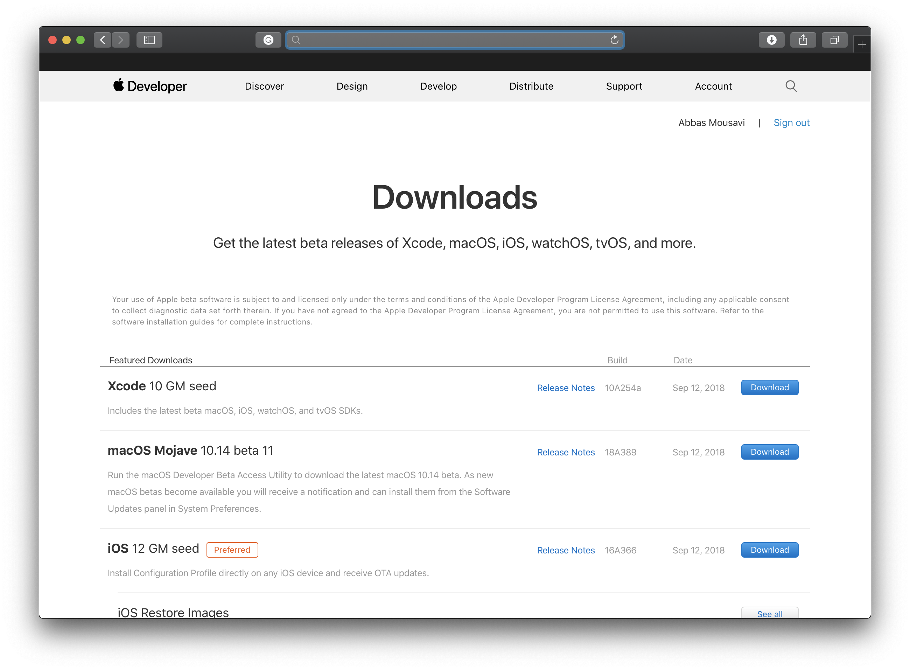
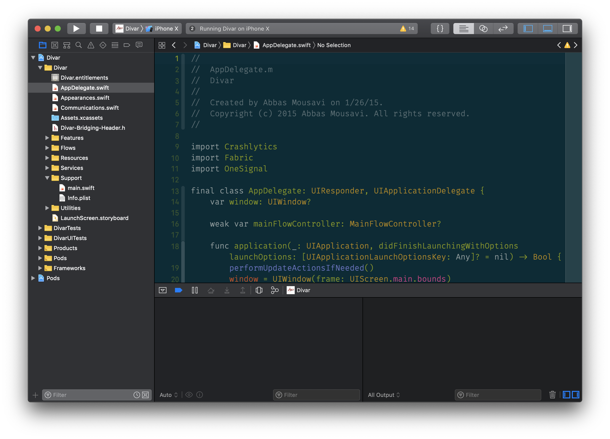
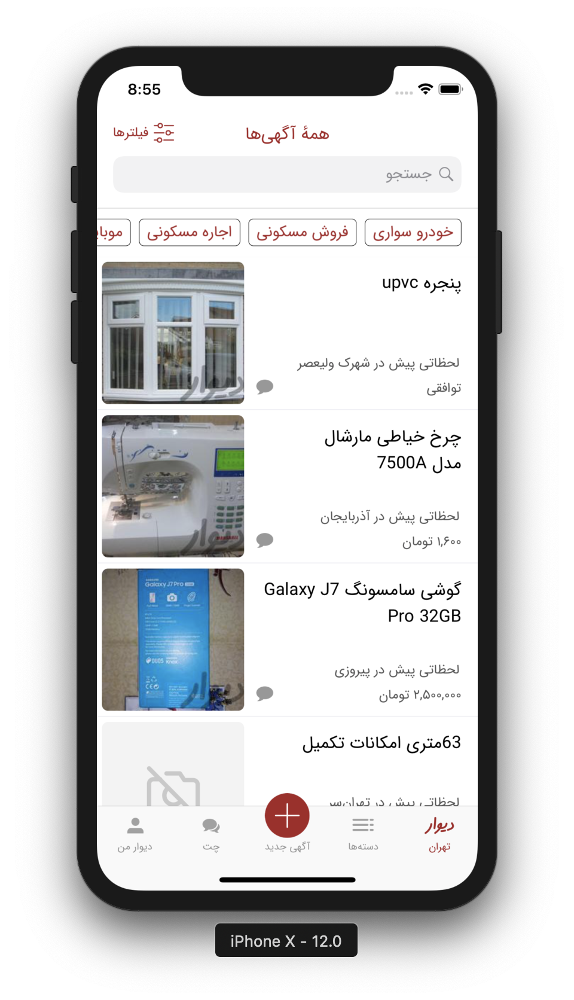
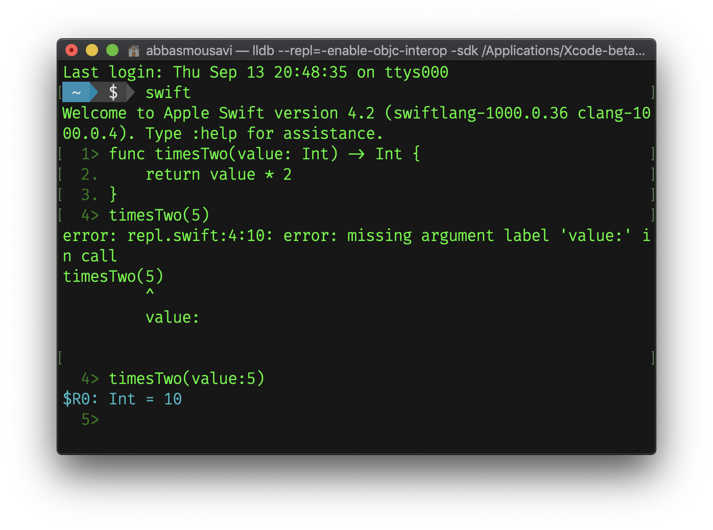
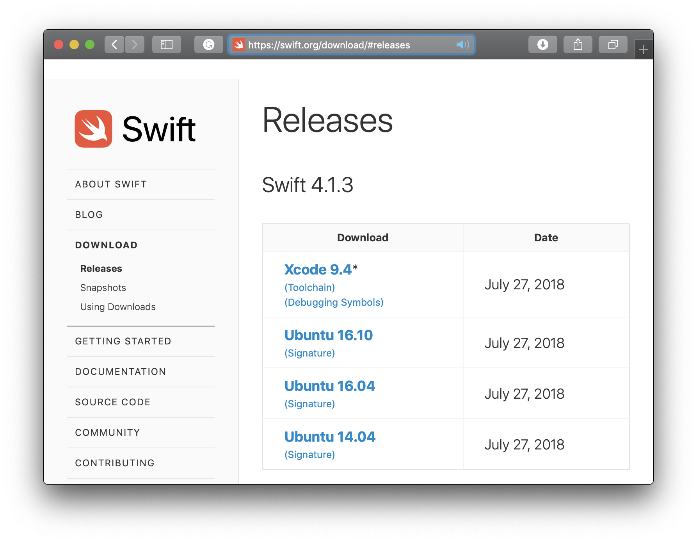

# Session #1

---

##  What will I learn in this course?

- Main goal is developing a real life mobile application

- Swift programming language
- iOS platform (UI, Graphics, Animation, Networking, Location, Media, ...)
- Design patterns and architecture of mobile programs
- Designing user interface/interaction on mobile devices

---

## Prerequisites

- Programming Basics
- Object Oriented Programming
- Being interested in mobile development
- Access to a Mac and an iPhone/iPad

---

## Evaluation

- (49%) A real life iOS application at the end of semester
- (41%) Some short coding tasks during the semester
- (10%) Final exam

---

# What is iOS
---

## Layers of iOS

- Core OS: Free BSD UNIX
- Core Services: ARC, GCD, SQLite, Accounts, Address Book, Network, Code Date, Core Foundation, Core Location, Core Media, Core Telephony, Event Kit, 
- Media: Core Graphics, Core Animation, Metal, Media Player, Core Audio, Core Video
- Cocoa Touch: UIKit, GameKit, MapKit, Message UI, Event UI, AddressBook UI

---

# Tools
---

## XCode
`https://developer.apple.com`

---
## XCode

---

## XCode  Playground

---
## REPL, On Linux, Bash Script or Compiled

 

---

## Sources

- The swift programming language: 
`https://docs.swift.org/swift-book/`
- Apple Developer Documentation: 
`https://developer.apple.com/documentation/`
- App Architecture Book
- Human Interface Guideline:
`https://developer.apple.com/design/human-interface-guidelines/`