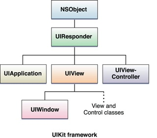
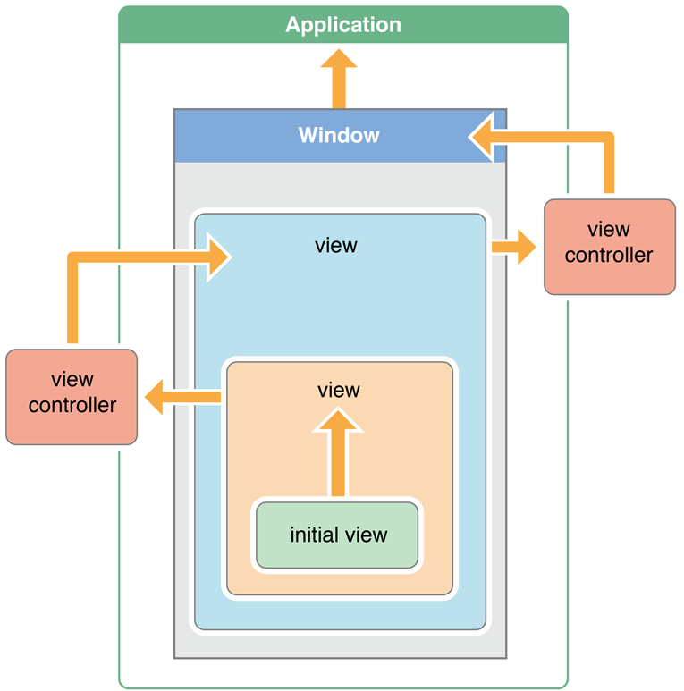

# Session #4

---

##  The main run loop and events

- Runs on main thread
- The app should handle different type of events: Touch, Shake, Motion Sensors, Location, Redraw, ...

---

## Lifecycle of an iOS app
- Not Lunched
- Running in foreground, Not receiving events
- Running in foreground, Receiving events
- Executing code in background
- In background, remains in memory but not executing code

---

## Lifecycle of an iOS app - cont.

- `application:willFinishLaunchingWithOptions:`
Thisfirst chance to execute code at launch time.
- `application:didFinishLaunchingWithOptions:`
perform any final initialization before your app is displayed to the user.
- `applicationDidBecomeActive:`
it is about to become the foreground app. Use this method for any last minute preparation.
- `applicationWillResignActive:`
your app is transitioning away from being the foreground app
- `applicationDidEnterBackground:`
app is now running in the background and may be suspended at any time.
- `applicationWillEnterForeground:`
app is moving out of the background and back into the foreground, but that it is not yet active.
- `applicationWillTerminate:`
app is being terminated. This method is not called if your app is suspended.

---
## What can be done in background

- For most apps, the background state is just a brief stop on the way to the app being suspended
- Apps can ask for a short time to complete tasks
- Downloads can be continued in background
- Some specific tasks can be executed in background with required permissions and declarations. Audio contents, Tracking location, VoIP, Apps with regular content, Apps that work with external accessories.

---
## App termination

- Apps must be prepared to terminate any time!
- Suspended Apps receive no notification when terminated by system.
- User can also terminate the app

---

## Responder Chain

---

## Views

A view (an object whose class is UIView or a subclass of UIView) knows how to draw itself into a rectangular area of the interface.

- View are organized in a Tree (The view hierarchy)
- Views are the interface that the user sees, also the interface that the user touches. 
- A view may come from a nib, or you can create it in code.

---

## How an app starts?

